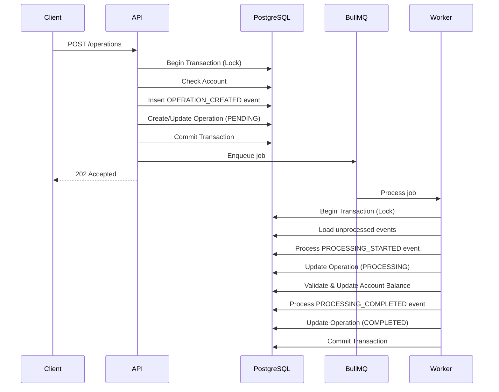
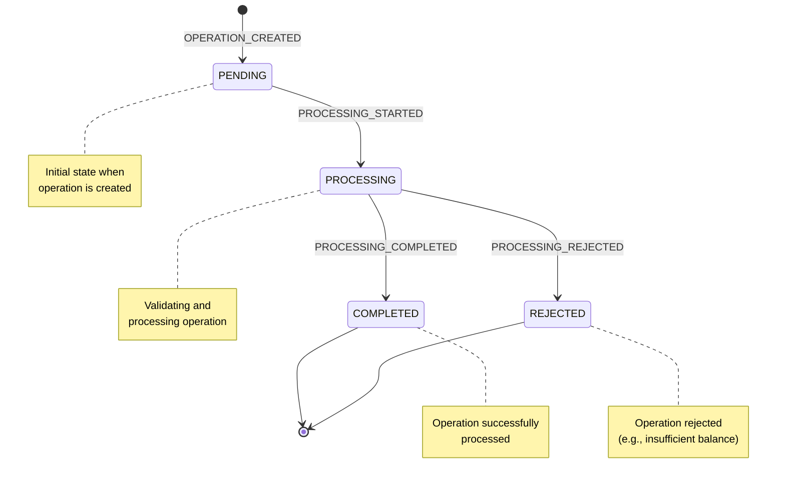
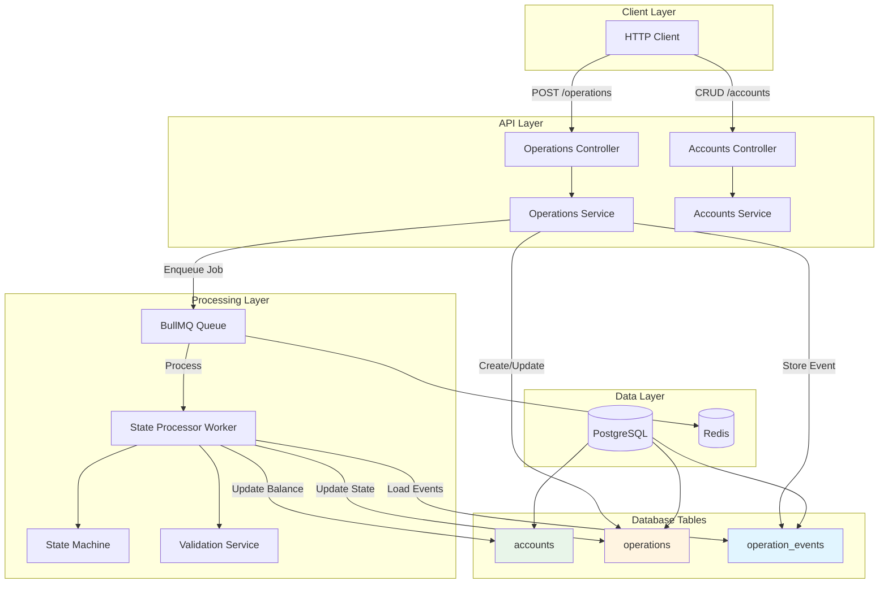
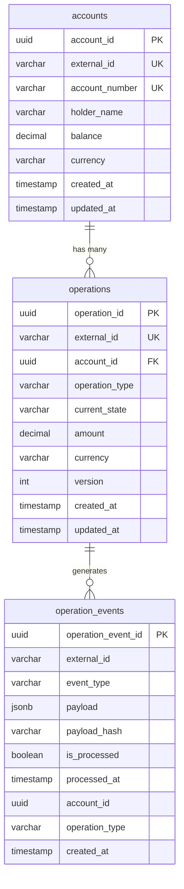

# Operations Processing Service

Event Sourcing Operations Endpoint with NestJS, PostgreSQL, BullMQ, and Redis.

## Features

- Event Sourcing architecture
- State machine for operation processing
- Idempotency guaranteed
- Support for out-of-order events
- Pessimistic locking with PostgreSQL (SELECT FOR UPDATE)
- Asynchronous processing with BullMQ
- Credit/Debit operations linked to accounts
- Balance validation for debit operations
- RESTful API with Swagger documentation
- Account management (CRUD operations)
- Automatic account number generation

## Prerequisites

- Node.js 18+
- Docker and Docker Compose
- yarn

## Setup

### Quick Start (Recommended)

The easiest way to start the application is using the `yarn dev` command, which will:

1. Start Docker services (PostgreSQL and Redis)
2. Wait 5 seconds for services to be ready
3. Run database migrations
4. Start the development server with auto-reload

```bash
# Install dependencies
yarn install

# Start everything (Docker + Migrations + Dev Server)
yarn dev
```

The API will be available at `http://localhost:3000`  
Swagger documentation will be available at `http://localhost:3000/api`

### Manual Setup

If you prefer to set up manually:

1. **Install dependencies**:

```bash
yarn install
```

2. **Start Docker services** (PostgreSQL and Redis):

```bash
yarn docker:up
```

3. **Create .env file** (optional - defaults are configured):

The application uses environment variables with sensible defaults. You can create a `.env` file if you need to override them:

```bash
# .env (optional)
DATABASE_HOST=localhost
DATABASE_PORT=5433
DATABASE_USER=operations_user
DATABASE_PASSWORD=operations_pass
DATABASE_NAME=operations_db

REDIS_HOST=localhost
REDIS_PORT=6380
REDIS_PASSWORD=

PORT=3000
NODE_ENV=development
```

**Note**: If you have other services running on the default ports, the Docker Compose is configured to use alternative ports:

- PostgreSQL: **5433** (instead of 5432) - Set `DATABASE_PORT=5433` in your `.env` file
- Redis: **6380** (instead of 6379) - Set `REDIS_PORT=6380` in your `.env` file

4. **Run migrations**:

```bash
yarn migration:run
```

This will execute all TypeORM migrations in the `src/core/migrations/` directory.

**Other migration commands**:

- `yarn migration:generate src/core/migrations/MigrationName` - Generate a new migration
- `yarn migration:revert` - Revert the last migration
- `yarn migration:show` - Show migration status

5. **Start the application**:

```bash
yarn start:dev
```

## Docker

### Docker Compose Setup

The project uses Docker Compose to run PostgreSQL and Redis services. The configuration is located in `docker/docker-compose.yml`.

#### Services

- **PostgreSQL 16** (Alpine)
  - Container name: `operations-postgres`
  - Port mapping: `5433:5432`
  - Database: `operations_db`
  - User: `operations_user`
  - Password: `operations_pass`
  - Health check: `pg_isready`
  - Data persisted in volume: `postgres_data`

- **Redis 7** (Alpine)
  - Container name: `operations-redis`
  - Port mapping: `6380:6379`
  - AOF (Append Only File) persistence enabled
  - Health check: `redis-cli ping`
  - Data persisted in volume: `redis_data`

#### How Docker Works

1. **Health Checks**: Both services have health checks configured to ensure they're ready before the application connects
2. **Data Persistence**: Volumes are used to persist data between container restarts
3. **Port Mapping**: Ports are mapped to avoid conflicts with local services (5433 for PostgreSQL, 6380 for Redis)
4. **Isolated Environment**: Each service runs in its own container with proper networking

#### Docker Commands

- `yarn docker:up` - Start PostgreSQL and Redis containers in detached mode
- `yarn docker:down` - Stop containers (data is preserved)
- `yarn docker:logs` - View logs from all containers (follow mode)
- `yarn docker:clean` - Stop containers and remove volumes (⚠️ **WARNING**: This will delete all data)

#### Development Workflow with Docker

When you run `yarn dev`:

1. Docker Compose starts the containers
2. The script waits 5 seconds for health checks to pass
3. Migrations run automatically
4. The NestJS dev server starts with hot-reload

If you need to restart just the database:

```bash
yarn docker:down
yarn docker:up
yarn migration:run  # Only if schema changed
yarn start:dev
```

## API Documentation (Swagger)

The API includes interactive Swagger documentation that can be accessed at:

**http://localhost:3000/api**

The Swagger UI provides:

- Complete API documentation
- Interactive endpoint testing
- Request/response schemas
- Authentication requirements (if applicable)
- Examples for all endpoints

You can test all endpoints directly from the Swagger interface.

## API Endpoints

### Accounts

#### POST /accounts

Create a new account.

**Request Body**:

```json
{
  "externalId": "acc-123",
  "holderName": "John Doe",
  "balance": 1000.0,
  "currency": "USD"
}
```

**Response**: `201 Created`

```json
{
  "accountId": "123e4567-e89b-12d3-a456-426614174000",
  "externalId": "acc-123",
  "accountNumber": "0000001000",
  "holderName": "John Doe",
  "balance": 1000.0,
  "currency": "USD",
  "createdAt": "2024-01-01T00:00:00.000Z",
  "updatedAt": "2024-01-01T00:00:00.000Z"
}
```

**Note**: `accountNumber` is automatically generated using a sequence.

#### GET /accounts

Get all accounts.

**Response**: `200 OK` - Array of accounts

#### GET /accounts/:id

Get account by UUID.

**Response**: `200 OK` - Account object

#### GET /accounts/external/:externalId

Get account by external ID.

**Response**: `200 OK` - Account object

#### PATCH /accounts/:id

Update account holder name.

**Request Body**:

```json
{
  "holderName": "Jane Doe"
}
```

**Response**: `200 OK` - Updated account object

#### DELETE /accounts/:id

Delete an account.

**Response**: `204 No Content`

### Operations

#### POST /operations

Create a new credit or debit operation.

**Request Body**:

```json
{
  "externalId": "op-123",
  "accountId": "123e4567-e89b-12d3-a456-426614174000",
  "operationType": "CREDIT",
  "amount": 100.5,
  "currency": "USD"
}
```

**Response**: `202 Accepted` - Operation object

**Note**:

- `accountId` must be a valid UUID of an existing account
- Operations are processed asynchronously
- The operation state will transition: PENDING → PROCESSING → COMPLETED/REJECTED
- Duplicate `externalId` is not allowed (returns `422 UnprocessableEntityException`)

#### GET /operations/:id

Get operation by UUID.

**Parameters**:

- `id` (path parameter): UUID of the operation

**Response**: `200 OK` - Operation object

**Example Response**:

```json
{
  "operationId": "123e4567-e89b-12d3-a456-426614174000",
  "externalId": "op-123",
  "accountId": "123e4567-e89b-12d3-a456-426614174000",
  "operationType": "CREDIT",
  "currentState": "COMPLETED",
  "amount": 100.5,
  "currency": "USD",
  "version": 3,
  "createdAt": "2024-01-01T00:00:00.000Z",
  "updatedAt": "2024-01-01T00:00:05.000Z",
  "account": {
    "accountId": "123e4567-e89b-12d3-a456-426614174000",
    "externalId": "acc-123",
    "accountNumber": "0000001000",
    "holderName": "John Doe",
    "balance": 1100.5,
    "currency": "USD"
  }
}
```

**Error Responses**:

- `404 Not Found`: Operation not found

## Architecture

- **Event Sourcing**: All events are stored in `operation_events` table
- **State Machine**: Operations transition through states: PENDING → PROCESSING → COMPLETED/REJECTED
- **Idempotency**: Events are deduplicated using `(external_id, event_type, payload_hash)`
- **Pessimistic Locking**: PostgreSQL SELECT FOR UPDATE ensures sequential processing per `external_id`
- **Asynchronous Processing**: BullMQ workers process state transitions

## Event Sourcing

This service implements Event Sourcing, a pattern where all changes to application state are stored as a sequence of events. Instead of storing the current state directly, we store events that describe state changes, and reconstruct the current state by replaying these events.

### How It Works

1. **Event Store**: All events are persisted in the `operation_events` table, creating an immutable audit log of all operations.

2. **State Projection**: The `operations` table serves as a materialized view/projection of the current state, derived from events for fast reads.

3. **Event Processing**:
   - When a new operation is created, an `OPERATION_CREATED` event is stored
   - Events are processed asynchronously via BullMQ workers
   - Each event transitions the operation through the state machine
   - Events are processed in order using pessimistic locking to ensure consistency

4. **Idempotency**: Events are deduplicated using a composite key `(external_id, event_type, payload_hash)`, ensuring that duplicate events are not processed multiple times.

5. **Benefits**:
   - Complete audit trail of all operations
   - Ability to replay events to reconstruct state at any point in time
   - Support for out-of-order event processing
   - Time-travel debugging capabilities

### Event Flow Diagram



### State Machine Diagram



### Architecture Diagram



## Database Schema

### Entity Relationship Diagram



### Tables Description

- **`accounts`**: Account information with balance
  - Primary key: `account_id` (UUID)
  - Unique constraints: `external_id`, `account_number`
  - Fields:
    - `external_id`: External identifier for the account
    - `account_number`: Auto-generated account number (10 digits, zero-padded, starting from 1000)
    - `holder_name`: Name of the account holder
    - `balance`: Current account balance
    - `currency`: Currency code (ISO 4217, 3 characters)
  - Sequence: `account_number_seq` (starts at 1000)

- **`operations`**: Current state projection
  - Primary key: `operation_id` (UUID)
  - Unique constraint: `external_id`
  - Foreign key: `account_id` → `accounts.account_id` (CASCADE on delete)
  - Represents the current state of an operation (materialized view from events)
  - Fields:
    - `external_id`: External identifier for the operation
    - `current_state`: Current state (PENDING, PROCESSING, COMPLETED, REJECTED)
    - `operation_type`: Type of operation (CREDIT, DEBIT)
    - `version`: Optimistic locking version number
  - Indexed on: `external_id`, `account_id`, `current_state`

- **`operation_events`**: Event store (all events)
  - Primary key: `operation_event_id` (UUID)
  - No unique constraints (allows duplicate events for idempotency)
  - Stores all events with payload, hash, and processing status
  - Fields:
    - `external_id`: Links event to operation
    - `event_type`: Type of event (OPERATION_CREATED, PROCESSING_STARTED, PROCESSING_COMPLETED, PROCESSING_REJECTED)
    - `payload`: JSONB payload with event data
    - `payload_hash`: SHA-256 hash for deduplication
    - `is_processed`: Whether the event has been processed
    - `processed_at`: Timestamp when event was processed
  - Indexed on: `external_id`, `(external_id, is_processed)`, `(external_id, event_type, payload_hash, is_processed)`

## Development

```bash
# Quick start (Docker + Migrations + Dev Server)
yarn dev

# Development mode with auto-reload (after Docker is running)
yarn start:dev

# Build
yarn build

# Production
yarn start:prod

# Code formatting
yarn format

# Linting
yarn lint
```

## Testing

The project implements a **complete test pyramid** using Testcontainers for real infrastructure (PostgreSQL and Redis).

### Test Structure

```
        /\
       /  \
      / E2E \        ← End-to-End Tests (10%)
     /--------\
    /          \
   / Integration \   ← Integration Tests (20%)
  /--------------\
 /                \
/   Unit Tests     \  ← Unit Tests (70%)
/------------------\
```

#### Unit Tests
- **Location**: `src/**/*.spec.ts`
- **Characteristics**: 
  - Completely isolate components
  - Use mocks for all dependencies
  - Fast and isolated
  - Example: `src/operations/processors/operation-state.processor.spec.ts`

#### Integration Tests
- **Location**: `test/**/*.integration.spec.ts`
- **Characteristics**:
  - Test multiple components together (Controller + Service + TypeORM)
  - Use Testcontainers for real PostgreSQL and Redis
  - Mock only BullMQ Worker (doesn't process jobs)
  - Example: `test/operations.integration.spec.ts`

#### E2E Tests (End-to-End)
- **Location**: `test/**/*.e2e-spec.ts`
- **Characteristics**:
  - Test complete application (AppModule)
  - Use Testcontainers for real PostgreSQL and Redis
  - Real worker processes jobs
  - Test complete flows: HTTP → Controller → Service → Database → Queue → Worker
  - Example: `test/operations.e2e-spec.ts`

### Test Commands

```bash
# Unit tests
yarn test

# Unit tests with watch mode
yarn test:watch

# Integration tests
yarn test:integration

# E2E tests
yarn test:e2e

# Test coverage
yarn test:cov

# Debug tests
yarn test:debug
```

### Testcontainers

Integration and E2E tests use **Testcontainers** to create isolated containers for PostgreSQL and Redis:

- **Isolation**: Each execution has its own containers
- **No local dependencies**: Doesn't require Docker running beforehand
- **CI/CD friendly**: Works in any environment with Docker
- **Real environment**: Tests with real PostgreSQL and Redis

**Requirements**:
- Docker installed and running
- Dependencies `testcontainers`, `@testcontainers/postgresql`, and `@testcontainers/redis` are installed

**Note**: Containers are automatically created before tests and destroyed after. This ensures complete isolation between executions.

## Project Structure

```
src/
├── accounts/              # Accounts module (CRUD)
│   ├── dto/              # Data Transfer Objects
│   ├── accounts.controller.ts
│   ├── accounts.service.ts
│   └── accounts.module.ts
├── operations/           # Operations module
│   ├── dto/              # Data Transfer Objects
│   ├── processors/       # BullMQ processors
│   ├── services/         # Business logic services
│   ├── state-machine/    # State machine implementation
│   ├── operations.controller.ts
│   ├── operations.service.ts
│   └── operations.module.ts
├── core/                 # Shared core entities and enums
│   ├── entities/         # TypeORM entities
│   ├── enums/            # Enumerations
│   └── migrations/       # Database migrations
├── config/               # Configuration files
│   ├── database.config.ts
│   ├── redis.config.ts
│   └── bullmq.config.ts
├── main.ts               # Application entry point
└── app.module.ts         # Root module
```

## Environment Variables

The application supports the following environment variables (all optional with defaults):

| Variable            | Default           | Description                  |
| ------------------- | ----------------- | ---------------------------- |
| `DATABASE_HOST`     | `localhost`       | PostgreSQL host              |
| `DATABASE_PORT`     | `5433`            | PostgreSQL port              |
| `DATABASE_USER`     | `operations_user` | PostgreSQL user              |
| `DATABASE_PASSWORD` | `operations_pass` | PostgreSQL password          |
| `DATABASE_NAME`     | `operations_db`   | PostgreSQL database name     |
| `REDIS_HOST`        | `localhost`       | Redis host                   |
| `REDIS_PORT`        | `6380`            | Redis port                   |
| `REDIS_PASSWORD`    | -                 | Redis password (if required) |
| `PORT`              | `3000`            | Application port             |
| `NODE_ENV`          | `development`     | Node environment             |
